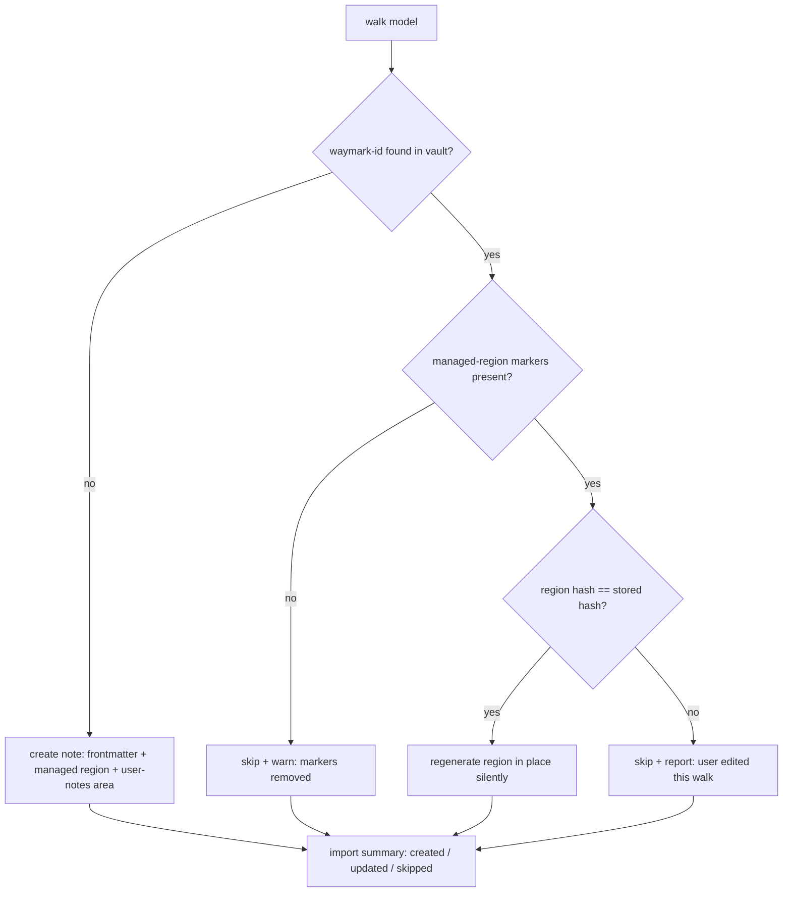

# feat: Waymark v1 — import .pilgrim into Obsidian as linkable walk notes

**Target repo:** `pilgrim-obsidian` (this plan was authored from the sibling `pilgrim-viewer` repo; all plan-relative paths below are relative to `pilgrim-obsidian` unless prefixed `../pilgrim-viewer/`).

## Summary

Build the Waymark Obsidian plugin: a manual `.pilgrim` import that generates one Markdown note per walk with the transcribed reflection as the note body. The plugin reuses `pilgrim-viewer`'s pure `.pilgrim` parser under a new Obsidian render layer, and writes notes idempotently — identity by a `waymark-id` frontmatter key, generated content inside a single comment-delimited managed region, never overwriting a walk the user has hand-edited. v1 ships transcription + photos + a route/stats summary; no rendered map.

---

## Problem Frame

A Pilgrim user who also keeps an Obsidian vault has no path from "I said something that mattered on a walk" to "that thought is connected to the rest of my thinking." The reflective material — transcribed voice notes, intentions, reflections — lives only in the app and a view-only web viewer. See origin (`docs/brainstorms/2026-05-31-waymark-requirements.md`) for the full pain narrative, actors, and the n=1 demand signal.

---

## Requirements

**Import & note generation**
- R1. Import a user-selected `.pilgrim` file from within Obsidian and generate one Markdown note per walk.
- R2. The transcribed voice reflection(s) are the note body, as searchable, wiki-linkable prose. *(Load-bearing.)*
- R3. Each note has frontmatter describing the walk via a stable, typed, documented schema.
- R4. Photos embed when present; a walk with none still produces a complete, valid note. **v1 scope: photos only — map rendering is explicitly deferred to v1.1 (see Scope Boundaries).**
- R5. Notes are self-contained (attachments referenced) so a single note can be moved or published without breakage.

**Re-import (idempotency)**
- R6. Re-import updates existing walk-notes in place keyed on walk UUID — no duplicates.
- R7. Re-import must not destroy content the user added. *(Mechanism resolved in this plan — see Key Technical Decisions.)*
- R8. Each note records provenance: source `.pilgrim` schema version, Pilgrim app version, Waymark version.

**Architecture / distribution**
- R9. Parse layer (`.pilgrim` → walk model) is kept separate from render layer (walk model → Obsidian markdown). v1 has one consumer, so this is a structural bet, not a functional need — justified because the split is near-zero-cost at greenfield time and the deferred multi-adapter extraction would otherwise require untangling Obsidian-specific code.
- R10. Packaged to be installable as an Obsidian community plugin, with "Pilgrim" in the searchable id/name.

**Origin actors:** A1 (Pilgrim+Obsidian user), A2 (Pilgrim app — produces `.pilgrim`, owns format), A3 (Obsidian vault & ecosystem — host).
**Origin flows:** F1 (first import), F2 (re-import / update), F3 (re-encounter & link).
**Origin acceptance examples:** AE1 (covers R4 — transcription, no photos/map → complete note), AE2 (covers R6 — re-import updates in place, no duplicate), AE3 (covers R7 — user edits survive re-import).

---

## Scope Boundaries

### Deferred for later

*(Carried from origin — product/version sequencing.)*

- **Map rendering** — the `.pilgrim` carries route GeoJSON but no map image; v1 renders none. Planned v1.1 approach: an **embedded viewer pane** that reuses `view.pilgrimapp.org` via its existing `pilgrimViewer.loadFile` bridge inside an Obsidian `ItemView` iframe (still requires a Mapbox token + network; lives in a pane, not in the portable note). A `leaflet`-code-block route remains a lighter fallback.
- Daily-note merge, theme graph, Dataview dashboards, place backlinks, contemplative AI review, celestial-hook queries.
- **Multi-adapter engine** — Logseq/Day One/Notion from the same parse layer. v1 vendors the parser rather than extracting a shared package (see Alternatives).
- Richer re-import conflict UX (three-way merge / diff view) beyond v1's preserve-and-skip.

### Outside this product's identity

*(Carried from origin — positioning rejection.)*

- Bidirectional sync (Obsidian → Pilgrim).
- Defining or owning the `.pilgrim` format spec (stays upstream in the app/viewer).
- A general-purpose GPS/notes importer.

### Deferred to Follow-Up Work

*(Plan-local sequencing.)*

- Community-directory submission via the Obsidian developer dashboard happens after v1 is dogfooded; U8 only prepares the release assets/metadata.
- A sidecar `uuid → path` index as a lookup accelerator (v1 uses the metadata-cache scan only).

---

## Context & Research

### Relevant Code and Patterns

- `../pilgrim-viewer/src/parsers/pilgrim.ts` — `parsePilgrim` (ZIP load via JSZip, `urlFactory`/`urlRevoker` injection seams) and `parsePilgrimWalkJSON` (pure, DOM-free — the highest-value reuse). `parseWalkPhotos` defensive validation, `deriveActivities`, `epochToDate`, `convertRouteTimestamps`.
- `../pilgrim-viewer/src/parsers/types.ts` — `Walk`, `WalkStats`, `VoiceRecording`, `CelestialContext`, `PilgrimManifest`, `ModOp`, `ModPayload`, `Modification`, `ArchivedWalk`.
- `../pilgrim-viewer/src/edit/applier.ts` — `applyMods(walk, mods)` reducer; the reference for replaying `manifest.modifications[]` (`edit_transcription` matches a recording by `Math.floor(startDate/1000)`; `archive_walk` → walk skipped). Route-trim ops depend on `route-trim.ts` and can be no-ops for v1.
- `../pilgrim-viewer/tests/fixtures/sample-walk.json`, `sample-manifest.json` — canonical on-disk shapes; copy as Waymark fixtures.
- Build/test baseline to mirror: TypeScript strict ESM, Vitest, `tests/` mirroring `src/`, in-memory JSZip archives, BDD `#given/#when/#then` comments. (No `AGENTS.md`/`CLAUDE.md` in `pilgrim-viewer`; global TS rules apply — named exports, explicit return types on exports, no unjustified `any`, kebab-case filenames.)

### External References

- Obsidian sample plugin (scaffold, esbuild, manifest, `src/main.ts`): https://github.com/obsidianmd/obsidian-sample-plugin — `id` must not contain "obsidian" (use `waymark`); esbuild externalizes `obsidian`/`electron`/codemirror/node-builtins, so JSZip bundles into `main.js`.
- `Vault.process` (atomic body read-modify-write): https://docs.obsidian.md/Reference/TypeScript+API/Vault/process
- `FileManager.processFrontMatter` (atomic, additive — preserves user keys): https://docs.obsidian.md/Reference/TypeScript+API/FileManager/processFrontMatter
- `getAvailablePathForAttachment` + `generateMarkdownLink` (respect user settings): Obsidian FileManager API.
- File read: hidden `<input type="file" accept=".pilgrim">` → `File.arrayBuffer()`; JSZip works in the Electron renderer.
- Idempotency precedents: Readwise official (append-only), Readwise Mirror / renehernandez `%% id %%` matching (regenerate with frontmatter-protection), markdown-magic (managed-block delimiters), Obsidian Importer #142 (filename-keyed → duplicates, the anti-pattern).
- Submission (2025+): Obsidian Community developer dashboard; GitHub release tag == `manifest.version` (no `v`), assets `main.js`/`manifest.json`/`styles.css`.

---

## Key Technical Decisions

- **Reuse `parsePilgrimWalkJSON` + `types.ts` via vendoring (copy), not a shared package.** Pure and DOM-free; copying avoids cross-repo build coupling for v1. A shared package is the future multi-adapter move (see Alternatives). *(Advances R9.)*
- **Redirect photos through the `urlFactory` seam, but defer the write.** `urlFactory` is synchronous (`(blob) => string`) while `Vault.createBinary` is async — so the injected factory only computes a deterministic path (`waymark-<walkId>-<n>.jpg`) and stashes the `(blob, path)` pair; the async binary writes happen in U6 after `parsePilgrim` resolves. For idempotency, U6 checks that path's existence directly (not `getAvailablePathForAttachment`, which appends ` 1.jpg` on collision) and skips the write when the attachment already exists. *(R4, R5.)*
- **Replay the edit layer per-walk; don't resurrect archived walks.** Filter `manifest.modifications[]` to each walk's id (`mods.filter(m => m.walkId === walkId)`, mirroring `save.ts`'s `modsForWalk`) *before* applying — `applyMods` archives the walk if *any* passed mod is `archive_walk`, so the whole array must never be handed to every walk. v1 does **not** recompute stats on edit (the reference `applyMods` calls `recomputeStats`/`geo.ts`; we preserve parsed `walk.stats` since v1 doesn't trim routes). On a saved `.pilgrim`, archived walks are already removed from `walks/` and listed in `manifest.archived[]`, so v1 simply must not generate notes for `manifest.archived[]` ids (the live `archive_walk`-mod path is dead for exported files). *(R2, R6.)*
- **Identity = a `waymark-id` frontmatter key, located via the metadata cache.** Rename/move-proof (filename-keying is the Obsidian Importer duplicate bug). Build an in-memory `Map<uuid, TFile>` once per import for O(1) lookup. *(R6.)*
- **Generated content lives in one managed region; user content outside it is never read or written.** Delimit with Obsidian comments (`%% waymark:begin id=<uuid> %% … %% waymark:end %%`, invisible in reading view). Transcription body, stats summary, and photo embeds go inside; a user-notes area sits below the end marker. *(R2, R5, R7.)*
- **User-edit safety = fingerprint-gated preserve-and-skip (never overwrite).** Store a normalized hash of the last-written region (`waymark-block-hash`). On re-import: hash matches → regenerate in place (silent); hash differs → user edited the region → **skip, preserve, report** in the import summary; markers missing but id present → skip + warn (never whole-file rewrite); no matching id → create new. Whitespace/newline-normalize before hashing to avoid false positives from Obsidian's own reformatting. *(R7; resolves origin's deferred R7 mechanism.)*
- **Frontmatter is flat, `waymark-` prefixed, written against an allowlist.** `processFrontMatter` only writes/overwrites Waymark-owned keys, never deletes or touches user keys. Lowercase-hyphenated keys + ISO date strings + unquoted numbers so Dataview can query later. *(R3, R8.)*
- **Atomic writes, atomic skip:** `Vault.process` for the managed-region body, `processFrontMatter` for metadata — both close the TOCTOU window. The merge decision is atomic across **both** channels: `skipped-edited` and `skipped-no-markers` write *neither* body *nor* frontmatter (no `waymark-block-hash` refresh), so a skipped walk's stored hash keeps describing the preserved body and the walk can still recover on a later clean import. *(R7.)*

---

## Open Questions

### Resolved During Planning

- *Map in v1?* → No. Deferred to v1.1 embedded-viewer pane (user decision).
- *User-edit preservation mechanism?* → Managed region + fingerprint preserve-and-skip (see Key Technical Decisions).
- *Multi-recording layout?* → One subsection per recording in `startDate` order, each with a relative-time heading and an "enhanced" marker when `isEnhanced`.
- *Parser sharing?* → Vendor for v1; shared package deferred.

### Deferred to Implementation

- Exact `waymark-` frontmatter key set and the route/stats summary's precise fields — drafted in U4 against the real walk model; tune against a photo-bearing sample.
- Hash normalization rules (which whitespace/property reformatting counts as benign) — tuned in U5 against real Obsidian round-trips.
- Whether the file picker is a hidden `<input>` vs a vault-dropped-file path read via the adapter — settled in U7; `<input>` is the leading candidate (mobile-safe, no `isDesktopOnly`).
- The `photos[]` JSON keys (`embeddedPhotoFilename`, `localIdentifier`, `capturedAt/Lat/Lng`) are documented in `pilgrim.ts` but not exercised by a repo sample — validate against a real photo-bearing `.pilgrim` during U2/U6.

---

## Output Structure

    pilgrim-obsidian/
    ├── manifest.json            # id "waymark", minAppVersion, isDesktopOnly:false
    ├── versions.json
    ├── package.json             # obsidian, jszip, esbuild, typescript, vitest
    ├── tsconfig.json
    ├── esbuild.config.mjs
    ├── styles.css
    ├── .gitignore
    ├── README.md
    ├── src/
    │   ├── main.ts              # Plugin: onload, command, ribbon, settings
    │   ├── settings.ts          # PluginSettingTab + defaults (walks folder, etc.)
    │   ├── import/
    │   │   └── orchestrator.ts  # picker → parse → replay edits → render → write → summary
    │   ├── parse/               # vendored, DOM-free
    │   │   ├── pilgrim.ts       # parsePilgrim + parsePilgrimWalkJSON (adapted)
    │   │   ├── types.ts
    │   │   └── apply-mods.ts    # edit-layer replay + archived filter
    │   ├── render/
    │   │   └── walk-note.ts     # walk model → { frontmatter, bodyMarkdown, attachments }
    │   └── vault/
    │       ├── merge.ts         # PURE: managed-region + fingerprint → decision
    │       └── writer.ts        # wires merge into Vault.process / processFrontMatter
    ├── tests/
    │   ├── fixtures/            # sample-walk.json, sample-manifest.json, *.pilgrim
    │   ├── parse/
    │   ├── render/
    │   └── vault/
    └── docs/
        ├── brainstorms/         # origin requirements doc
        └── plans/               # this plan

*Scope declaration, not a constraint — the implementer may adjust layout.*

---

## High-Level Technical Design

> *This illustrates the intended approach and is directional guidance for review, not implementation specification. The implementing agent should treat it as context, not code to reproduce.*

**Layering (R9 — parse stays adapter-agnostic):**

```
.pilgrim ──▶ parse/ (vendored, pure) ──▶ walk model ──▶ render/ (Obsidian) ──▶ { frontmatter, body, attachments }
                                              │                                          │
                              apply-mods (replay edits, drop archived)            vault/ writer (idempotent)
```

**Per-walk import decision (R6/R7 — the safety-critical path):**



**Generated note anatomy (managed region bracketed; everything outside is user territory):**

```
---  (frontmatter: waymark-id, waymark-version, waymark-block-hash, date, distance-km, duration, intention, moon, …)
%% waymark:begin id=<uuid> — Waymark-managed; edits here are NOT preserved. Write below the end marker. %%
## Reflection            ← transcription(s), startDate order, "enhanced" marker
## On this walk          ← stats summary (distance, ascent, duration), photo embeds
%% waymark:end %%

## Notes                 ← seeded only on note creation; never touched again — safe user space
```

---

## Implementation Units

### U1. Scaffold the plugin project

**Goal:** A buildable, type-checking Obsidian plugin skeleton.

**Requirements:** R10

**Dependencies:** None

**Files:**
- Create: `manifest.json`, `versions.json`, `package.json`, `tsconfig.json`, `esbuild.config.mjs`, `styles.css`, `.gitignore`, `src/main.ts`

**Approach:**
- Start from the official `obsidian-sample-plugin` layout. `manifest.json` id `waymark`, `isDesktopOnly: false`, conservative `minAppVersion` (~1.4.0). Add `jszip` to dependencies (it bundles into `main.js`).
- `src/main.ts`: a `Plugin` subclass with empty `onload`/`onunload` to start; real wiring lands in U7.
- Initialize the repo as git, mirror `pilgrim-viewer`'s strict ESM `tsconfig` baseline.

**Patterns to follow:** `obsidian-sample-plugin`; `../pilgrim-viewer/tsconfig.json`, `../pilgrim-viewer/package.json`.

**Test scenarios:**
- Test expectation: none — scaffolding. Gate: `npm run build` produces `main.js` and `tsc --noEmit` passes.

**Verification:** Plugin loads in a dev vault (empty command set) without console errors.

---

### U2. Vendor the `.pilgrim` parse layer

**Goal:** A pure, DOM-free `.pilgrim` → walk-model parser inside the plugin.

**Requirements:** R1, R2, R9

**Dependencies:** U1

**Files:**
- Create: `src/parse/pilgrim.ts`, `src/parse/types.ts`, `tests/parse/pilgrim.test.ts`, `tests/fixtures/sample-walk.json`, `tests/fixtures/sample-manifest.json`

**Approach:**
- Vendor the whole `pilgrim.ts` file (`parseWalkPhotos`, `epochToDate`, `convertRouteTimestamps` are file-private — copy the file rather than cherry-picking exports) plus the `types.ts` interfaces from `../pilgrim-viewer/src/parsers/`. Keep the `urlFactory`/`urlRevoker` seams on `parsePilgrim` (U6 injects the path-computing factory).
- Reuse the vendored `epochToDate` (already does seconds→Date) rather than adding a parallel helper. Note the boundary: all walk/manifest dates **and** `edit_transcription`'s `recordingStartDate` payload are epoch **seconds**; only `Modification.at` is ms.
- Sort `voiceRecordings` by `startDate` for deterministic body order downstream.

**Patterns to follow:** `../pilgrim-viewer/src/parsers/pilgrim.ts`, `../pilgrim-viewer/tests/parsers/pilgrim.test.ts` (url-seam stubbing).

**Test scenarios:**
- Happy: parse an in-memory `.pilgrim` (JSZip) → walks with correct `id`, dates (seconds → `Date`), `stats`, `intention`, `reflection`, and `voiceRecordings[].transcription`.
- Edge: archive with no `photos/` dir parses cleanly; a recording with no `transcription`; multiple recordings returned in `startDate` order; empty `walks/` → zero walks.
- Error: missing `manifest.json` throws the expected error; a corrupt walk JSON is surfaced, not silently swallowed.

**Verification:** Parsing `tests/fixtures` and a real exported `.pilgrim` yields the expected walk count and transcription text.

---

### U3. Edit-layer replay and archived-walk filtering

**Goal:** Walks reflect edits made in the Pilgrim editor; archived walks are excluded.

**Requirements:** R2, R6

**Dependencies:** U2

**Files:**
- Create: `src/parse/apply-mods.ts`, `tests/parse/apply-mods.test.ts`, `tests/fixtures/sample-manifest-edited.json` (multi-walk, with `walkId`-scoped `modifications[]` + a `manifest.archived[]` entry — the copied `sample-manifest.json` has neither, so it cannot exercise this unit)

**Approach:**
- **Filter mods to the walk first:** `mods.filter(m => m.walkId === walkId)` (mirror `save.ts`'s `modsForWalk`) before applying — `applyMods` archives the walk if *any* passed mod is `archive_walk`, so the full array must never reach every walk.
- Mirror `applyMods(walk, walkMods)`: apply content-affecting ops — `edit_transcription` matched by `Math.floor(recording.startDate/1000) === payload.recordingStartDate` (both seconds; never compare against `Modification.at`), plus `edit_intention`, `edit_reflection_text`, `delete_section`, `delete_*`. Do **not** call `recomputeStats` (preserve parsed `walk.stats`); route-trim ops are no-ops in v1.
- Exclude `manifest.archived[]` ids from note generation (those walks aren't in `walks/` on a saved file).
- Apply mods after parse (U2), before render (U4).

**Patterns to follow:** `../pilgrim-viewer/src/edit/applier.ts`, `../pilgrim-viewer/tests/edit/applier.test.ts`.

**Test scenarios:**
- Happy: `edit_transcription` replaces the transcription on the matching recording; no modifications → walk unchanged.
- Edge: two walks each with their own `edit_transcription` → each walk reflects only its own mod (proves per-walk filtering, no cross-walk leakage); `delete_section` removes `intention`/`reflection`; a `manifest.archived[]` id produces no note; a mod with a non-matching `walkId` leaves the walk untouched.
- Edge: a `recordingStartDate` off by 1000× matches no recording (guards the seconds-vs-ms boundary).
- Error: a malformed mod payload does not crash the run (skipped with a warning).

**Verification:** A fixture archive carrying `modifications[]` renders the edited transcription, and an archived walk produces no note.

---

### U4. Render layer — walk model → note content

**Goal:** A pure function producing a walk note's frontmatter, managed-region body, and attachment manifest.

**Requirements:** R2, R3, R4, R5, R8

**Dependencies:** U2

**Files:**
- Create: `src/render/walk-note.ts`, `tests/render/walk-note.test.ts`

**Approach:**
- Input: walk model + options (units, walks folder). Output: `{ frontmatter: Record<string,…>, bodyMarkdown: string, attachments: {sourcePhotoId, suggestedName}[] }`.
- Body (inside `%% waymark:begin %% … %% waymark:end %%`): a `## Reflection` section with one subsection per recording (`startDate` order, relative-time heading, `isEnhanced` marker); a `## On this walk` stats summary (distance, ascent/descent, active duration, talk/meditate split); photo embeds as placeholders the writer resolves to real links.
- Frontmatter: flat `waymark-` keys — `waymark-id`, `waymark-version`, ISO `date`, numeric `distance-km`/`duration-min`, `intention`, `moon` (`celestial.lunarPhase.name`), provenance (`waymark-schema`, `waymark-app-version`).
- Render only present fields; omit missing `intention`/`reflection`/`weather` without leaving empty sections or broken refs. **No map is rendered in v1** (deferred to v1.1) — the body carries photos and the stats summary only.

**Patterns to follow:** field names verified in `../pilgrim-viewer/src/parsers/types.ts`.

**Test scenarios:**
- `Covers AE1.` Happy: walk with transcription, no photos, no map → complete note with body + frontmatter and **no broken image references**.
- Edge: multiple recordings → ordered subsections with timestamps; `isEnhanced` recording shows the marker; walk missing `intention`/`reflection` omits those gracefully; zero-transcription walk still yields a valid note (empty Reflection note + stats).
- Happy: managed-region begin/end markers wrap exactly the generated content; frontmatter dates are ISO and distances numeric (Dataview-queryable).

**Verification:** Rendered markdown for fixtures matches expected snapshots; markers present and balanced.

---

### U5. Idempotent-merge engine (pure)

**Goal:** The safety-critical, Obsidian-free logic that decides create/update/skip and preserves user content.

**Requirements:** R6, R7

**Dependencies:** U4

**Files:**
- Create: `src/vault/merge.ts`, `tests/vault/merge.test.ts`

**Approach:**
- Pure functions over strings/objects. Inputs: existing file content (or none), the freshly generated region + frontmatter, the stored `waymark-block-hash`. Output: a decision (`created | updated | skipped-edited | skipped-no-markers`) and the new file content.
- Locate begin/end markers; on a clean match (region hash == stored hash) replace only between markers; on divergence return `skipped-edited` and leave content untouched; markers absent but id present → `skipped-no-markers`.
- Normalize (trim, newline-normalize) before hashing. Frontmatter merge: write only allowlisted `waymark-` keys, preserve all others.
- On `created`, seed the `## Notes` user area **once**; the engine never reads or writes anything below the end marker on any later import. `skipped-edited` / `skipped-no-markers` return the file unchanged and do **not** refresh `waymark-block-hash` (atomic skip across body + frontmatter).

**Execution note:** Test-first. This is the data-loss-risk surface (R7) — write the failing preservation tests before the implementation.

**Patterns to follow:** managed-block delimiter handling (markdown-magic); frontmatter allowlist merge.

**Test scenarios:**
- `Covers AE2.` Happy: no existing content → `created`; existing content with matching hash → `updated`, region replaced, content outside markers byte-identical.
- `Covers AE3.` Edge: user added a paragraph **below** the end marker → preserved on `updated`; user edited **inside** the region (hash diverges) → `skipped-edited`, file untouched.
- Edge: markers missing → `skipped-no-markers`, no write; only-whitespace/newline reformatting → treated as unchanged (no false `skipped-edited`); duplicated or reversed markers → safe skip, never whole-file rewrite.
- Frontmatter: a user-added key survives a merge that updates `waymark-` keys; no `waymark-` key collides with a user key.

**Verification:** Every preservation scenario is covered by a passing test before U6 wires it to the vault.

---

### U6. Obsidian vault writer

**Goal:** Wire the render output and merge engine into atomic vault writes and attachments.

**Requirements:** R1, R4, R5, R6, R7

**Dependencies:** U4, U5

**Files:**
- Create: `src/vault/writer.ts`, `tests/vault/writer.test.ts`

**Approach:**
- Build a `Map<uuid, TFile>` by scanning `metadataCache` for `waymark-id`. For each rendered walk: resolve the target note (existing or new path under the walks folder), run the merge engine, write the body via `Vault.process` and metadata via `processFrontMatter` (store/refresh `waymark-block-hash`).
- Photos: the `urlFactory` injected into `parsePilgrim` (U2) only computes the deterministic path `waymark-<walkId>-<n>.jpg` and records the `(blob, path)` pair (it's synchronous; the write can't be). After parse resolves, for each pair check `getAbstractFileByPath`; if absent, `createBinary` (ArrayBuffer from JSZip) the bytes — if present, reuse it (no duplicate, no ` 1.jpg`). Embed via `generateMarkdownLink`.
- Honor the merge decision atomically: on `skipped-*`, write neither body, frontmatter, nor attachments for that walk.

**Execution note:** Keep glue thin — push logic into U5 (pure) and U4 (pure); mock `Vault`/`FileManager`/`MetadataCache` in tests.

**Patterns to follow:** Obsidian `Vault.process`, `FileManager.processFrontMatter`, `getAvailablePathForAttachment`, `generateMarkdownLink`.

**Test scenarios:**
- `Covers AE2.` Integration: first write creates a note; re-import with matching `waymark-id` updates in place — exactly one note for the walk (no duplicate).
- `Covers AE3.` Integration: a note whose region the user edited is reported skipped and left byte-identical; user content outside the region survives an `updated` write.
- Edge: attachment written once; re-import reuses the deterministic name (no `-1.jpg` duplicates); a walk with no photos writes no attachments and no broken links.
- Error: a `YAMLParseError` from corrupted user frontmatter is caught and reported per-walk, not fatal to the whole import.

**Verification:** Re-importing the same `.pilgrim` twice in a dev vault yields a stable note set; a hand-edited walk is preserved and flagged.

---

### U7. Import orchestration and UX

**Goal:** The user-facing import flow and plugin wiring.

**Requirements:** R1, R10

**Dependencies:** U2, U3, U4, U5, U6

**Files:**
- Create: `src/import/orchestrator.ts`, `src/settings.ts`
- Modify: `src/main.ts`

**Approach:**
- File picker (hidden `<input type="file" accept=".pilgrim">` → `File.arrayBuffer()`). Orchestrator: parse (U2) → replay edits + drop archived (U3) → render (U4) → write (U6) → tally created/updated/skipped.
- `main.ts`: `addCommand("Import .pilgrim file…")`, `addRibbonIcon('footprints', …)`, `addSettingTab`. Settings: walks folder, attachment handling; persisted via `loadData`/`saveData`. Create the walks folder if missing at import (guarded — `createFolder` throws if it exists).
- Progress `Notice` during the run ("Importing walk N of M…"), then a result `Notice`.
- Result messaging distinguishes outcomes and stays recoverable: a normal tally ("Imported 7 walks — 3 new, 4 updated"); **skipped-edited** lists the affected walk names/dates with a one-line recovery hint ("edited since import — reset the managed region to allow re-import"); **skipped-no-markers** is a distinct message ("managed-region markers missing — note left untouched"); a **zero-walks** outcome says which ("no walks in this file" vs "all walks archived").

**Patterns to follow:** `obsidian-sample-plugin` `src/main.ts` + `src/settings.ts`.

**Test scenarios:**
- Happy: orchestrator over a fixture `.pilgrim` returns correct created/updated/skipped tallies (parse→write wired with mocks).
- Edge: an invalid/non-ZIP file surfaces a clear error Notice, no partial writes; settings round-trip (`saveData`/`loadData`).
- Integration: end-to-end fixture import produces the expected notes + attachments in a mock vault.

**Verification:** In a dev vault, the command imports a real `.pilgrim`, notes appear in the configured folder, and the summary Notice matches the file's walk count.

---

### U8. README and release/submission scaffolding

**Goal:** Repo is documented and releasable.

**Requirements:** R10

**Dependencies:** U7

**Files:**
- Create: `README.md`, `.github/workflows/release.yml`
- Modify: `manifest.json` (final author/description/version)

**Approach:**
- README: what Waymark does, install, the import flow, the user-notes-vs-managed-region contract (so users know where it's safe to write), and the v1.1 viewer-pane roadmap note.
- GitHub Actions release workflow attaching `main.js`/`manifest.json`/`styles.css` as individual assets on a tag matching `manifest.version` (no `v`). Actual community-directory submission is deferred (Scope Boundaries).

**Test scenarios:**
- Test expectation: none — docs/release config. Gate: a tagged build attaches the three assets.

**Verification:** A dry-run release produces the correct assets; README accurately describes the safe-edit contract.

---

## System-Wide Impact

- **Interaction graph:** Greenfield — no existing callers. The one external coupling is the vendored parser's drift from `../pilgrim-viewer` (see Risks).
- **Error propagation:** Per-walk failures (corrupt walk JSON, YAML parse error) are caught and reported in the summary; the import never aborts wholesale on one bad walk.
- **State lifecycle risks:** Partial import (crash between `processFrontMatter` and `Vault.process`) must converge on re-run — deterministic ids + hashes make re-import idempotent. Attachment orphans from a failed parse are cleaned by the `urlRevoker` path.
- **API surface parity:** None in v1 (single surface). The render/parse split is the seam future adapters reuse.
- **Unchanged invariants:** Waymark only writes inside its managed region and allowlisted frontmatter keys; all other note content is invariant across imports — this is the core R7 guarantee.

---

## Risk Analysis & Mitigation

| Risk | Likelihood | Impact | Mitigation |
|------|-----------|--------|------------|
| In-region user edit silently overwritten (reflection data loss) | Med | High | Fingerprint-gated preserve-and-skip (U5), tested test-first before vault wiring; never whole-file rewrite |
| Lost `waymark-id` → duplicate note on re-import | Med | Med | Treat id as plugin-owned, written via `processFrontMatter`; accept v1 limitation, document it; sidecar re-match deferred |
| Marker corruption (user/sync deletes a marker) | Low | Med | `skipped-no-markers` decision: skip + warn, never rewrite |
| Hash false-positives from Obsidian reformatting | Med | Low | Normalize whitespace/newlines before hashing (U5); tune in impl |
| Vendored parser drifts from `../pilgrim-viewer` source of truth | Med | Med | Document the vendor source + commit; revisit shared package when a 2nd adapter appears |
| Cold metadata cache on first launch → `waymark-id` scan misses existing notes → duplicates | Low | Med | Build the id map after the cache is ready; document the cold-cache caveat (sidecar index deferred) |
| `photos[]` JSON keys differ from the parser's expectation → silent empty attachments | Med | Med | Validate against a real photo-bearing `.pilgrim` in U2/U6; warn per-walk when a referenced photo doesn't resolve |
| `.pilgrim` schema evolves (new `schemaVersion`) | Low | Med | Store provenance (R8); additive parsing (unknown fields ignored, as the viewer does) |
| TOCTOU clobber from concurrent edit/sync | Low | High | `Vault.process` + `processFrontMatter` atomic APIs only; never `vault.modify` whole file |

---

## Alternative Approaches Considered

- **Shared parser package instead of vendoring:** rejected for v1 — adds cross-repo build/release coupling before a second adapter exists to justify it. Revisit when Logseq/Day One adapters are real.
- **Auto-update / last-writer-wins re-import (Readwise Mirror model):** rejected — would overwrite user edits inside the region, catastrophic for a journaling use case. v1 chooses preserve-and-skip; three-way merge is a future option (the stored hash is the eventual merge base).
- **Append-only import (official Readwise model):** rejected — can never correct a changed transcription or stats, and would not satisfy R6's in-place update.
- **Filename-keyed identity:** rejected — the Obsidian Importer duplicate-on-rename bug; frontmatter id is rename/move-proof.

---

## Sources & References

- **Origin document:** `docs/brainstorms/2026-05-31-waymark-requirements.md`
- Reference parser (source of truth for `.pilgrim`): `../pilgrim-viewer/src/parsers/pilgrim.ts`, `../pilgrim-viewer/src/parsers/types.ts`, `../pilgrim-viewer/src/edit/applier.ts`
- Obsidian plugin docs: https://docs.obsidian.md/Plugins/Getting+started/Build+a+plugin , https://github.com/obsidianmd/obsidian-sample-plugin
- `Vault.process`: https://docs.obsidian.md/Reference/TypeScript+API/Vault/process · `processFrontMatter`: https://docs.obsidian.md/Reference/TypeScript+API/FileManager/processFrontMatter
- Idempotency prior art: Readwise official (append-only), jsonMartin/readwise-mirror, renehernandez/obsidian-readwise, DavidWells/markdown-magic, obsidian-importer #142
